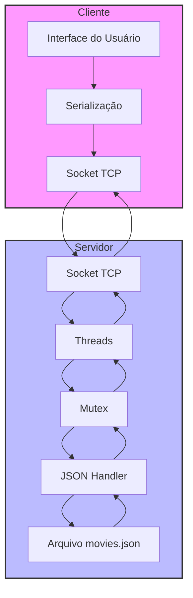

# Relatório Projeto 1 MC833

## 1. Introdução

Este projeto implementa um sistema de gerenciamento de filmes baseado em uma arquitetura cliente-servidor utilizando sockets TCP. Esse sistema permite que filmes sejam adicionados, removidos, que tenham seus gêneros atualizados e que sejam consultados. O armazenamento das informações dos filmes é feita em formato JSON. O cliente e o servidor se comunicam por meio de um socket TCP, no qual o servidor suporta simultaneamente diversos clientes por meio do uso de threads e mutex.


## 2. Diagrama da Arquitetura



O diagrama acima ilustra:
- Fluxo de dados entre cliente e servidor
- Componentes principais do sistema
- Processo de serialização/deserialização
- Gerenciamento de concorrência com threads e mutex
- Armazenamento persistente em JSON

## 3. Arquitetura do Sistema

### 3.1. TCP e Cliente-Servidor
O sistema desenvolvido utiliza de uma arquitetura cliente-servidor que suporta simultaneamente diversos clientes conectados ao mesmo servidor por meio de threads. Isso foi testado conectando 3 clientes ao mesmo tempo em um mesmo servidor, conferindo se os dados estavam atualizados em cada um e que quando uma ação era realizada em um cliente, a informação chegava atualizada para os outros. Essa sincronização de acesso aos dados foi possível por meio do uso de mutex, que permitia o acesso correto a recursos compartilhados. Ademais, a comunicação entre cliente-servidor é feita utilizando o TCP/IP, e, dessa forma, foram implementados configurações de sockets para que a comunicação entre dispositivos pudesse acontecer. Todos os dados adicionados, removidos, alterados ou consultados nas operações foram feitos a partir da comunicação com um arquivo JSON, o qual era alterado ao passo em que as movimentações ocorriam do lado dos clientes. 

### 3.2. Organização e Estrutura dos dados
O sistema utiliza as seguintes estruturas principais:
- `Request`: Estrutura para requisições do cliente
- `Response`: Estrutura para respostas do servidor
- `Movie`: Armazena informações de cada filme (ID, título, gêneros, diretor, ano)

## 4. Implementação

Inicialmente, durante a implementação, focamos em testar as funcionalidades quando o cliente e o servidor se encontravam no mesmo dispositivo. Essa escolha auxiliava nos casos em que não testavamos dentro do laboratório do IC, já que na rede remota Eduroam existem barreiras que impedem a conexão. Em casos diversos a esse, encontramos algumas alternativas que abordaremos na seção 6.


Para o desenvolvimento do sistema, implementamos o cliente e o servidor focando nas seguintes funcionalidades:

### 4.1. Cliente
O objetivo principal do cliente era oferecer uma interface que permitiria um usuário (ou mais de um) realizar operações com informações de filmes. Essas operações são:

  1. Cadastrar novo filme
  2. Adicionar gênero a um filme
  3. Remover filme por ID
  4. Listar todos os filmes
  5. Pesquisar filme por ID
  6. Listar filmes por gênero

Por meio delas, era necessario que a cada operação realizada por meio do qualquer cliente tivesse efeito no armanezamento do JSON e que os outros clientes também recebessem essas alterações. Para isso, evitando que multiplas threads acessem e modifiquem os mesmos dados, foi implmentada a logica de threads e o mutex, o qual tratamos com mais detalhes na seção do servidor.

A cada operação feita, o pedido era comunicado e enviado para o servidor e uma resposta era recebida, convertendo a estrutura para um formato serializado que possa ser compartilhado pela rede. Essa serialização se da porque o socks trabalha apenas com dados binarios ou strings, dessa forma, implementamos um arquivo serialization.c que converre os requests nesses formatos aceitos:

```c
memcpy(buffer + offset, &req->operationCode, sizeof(int));
offset += sizeof(int);
```

```c
serializeRequest(&req, buffer);
send(socket, buffer, bufferSize, 0);

Response resp;
recv(socket, buffer, bufferSize, 0);
deserializeResponse(buffer, &resp);
```

A implementação dos sockets TCP em sí foi realizada da seguinte forma, seguindo o fluxo de: criação, configuração do endereço do servidor, vinculação ao endereço, escuta, aceitação e comunicação. A comunicação era orquestrada de duas maneiras, recebendo os dados por meio do recv, onde os dados atualizados por outros clientes chegavam e por meio do send, pelo qual os dados eram enviados.

#### 4.1.1. Criação do Socket:

```c
int serverSocket = socket(AF_INET, SOCK_STREAM, 0);
if (serverSocket < 0) {
    perror("Erro ao criar socket");
    exit(EXIT_FAILURE);
}
```

#### 4.1.2. Configuração e vinculação ao servidor:

```c
struct sockaddr_in serverAddr;
serverAddr.sin_family = AF_INET;
serverAddr.sin_addr.s_addr = INADDR_ANY; // Aceita conexões de qualquer IP
serverAddr.sin_port = htons(PORT); 

if (bind(serverSocket, (struct sockaddr*)&serverAddr, sizeof(serverAddr)) < 0) {
    perror("Erro ao fazer bind");
    exit(EXIT_FAILURE);
}
```

#### 4.1.3. Escuta e aceitação:

```c
if (listen(serverSocket, MAX_CLIENTS) < 0) {
    perror("Erro ao escutar");
    exit(EXIT_FAILURE);
}
int clientSocket = accept(serverSocket, (struct sockaddr*)&clientAddr, &addrLen);
if (clientSocket < 0) {
    perror("Erro ao aceitar conexão");
    e
```

#### 4.1.4. Recebimento e envio de informações:

```c
recv(clientSocket, buffer, sizeof(buffer), 0);
send(clientSocket, response, sizeof(response), 0);
```


### 4.2. Servidor

Já para o servidor, o principal objetivo é gerenciar as operações realizadas pelos clientes, garantido que informações não sejam sobrescritas, vazadas, que a conexão seja feita de forma segura e que todos os dados sejam sincronizados, garantindo a comunização de multiplos clientes.

Para garantir a colaboração efetiva entre diversos clientes, dentro da implementação do servidor, foram utilizados threads e mutex para garantir que cada operação possa ser feita ser afetar os outros clientes, garantindo ao mesmo tempo a sincronização dos dados. O mutex é bloqueado antes que os dados compartilhados sejam acessados ou modificados e liberado após a ação ocorrer, previnindo dessa forma que multiplas threads acessem o memso dado.

```c
pthread_mutex_lock(&jsonMutex);
switch (req.operationCode) {
    case 1: // Cadastrar novo filme
        if (addMovie(req.title, req.director, req.releaseYear) == 0) {
            if (addGenreToMovie(movieCount, req.genre) == 0) {
                resp.responseCode = success;
            } else {
                resp.responseCode = error;
            }
        } else {
            resp.responseCode = error;
        }
        break;
    // Outros casos...
}
pthread_mutex_unlock(&jsonMutex);
```

Também é na implementação do servidor que os requests dos clientes são recebidos e ações são realizadas no arquivo JSON. Dessa forma, para cada operação presente na implementação do cliente, existe uma operação analoga no código do servidor que de fato chamam as funções de alterações no JSON.

```c
case 1: { // Cadastrar novo filme
  if (addMovie(req.title, req.director, req.releaseYear) == 0) {
      if (addGenreToMovie(movieCount, req.genre) == 0) {
          resp.responseCode = success;
      } else {
          resp.responseCode = error;
      }
  } else {
      resp.responseCode = error;
  }
  break;
}
```

No servidor também foi implementado tratamento de erros para que ficasse claro para o cliente utilizando o sistema onde possivelmente está ocorrendo um erro na tentativa de uso do sistema e para que conseguissemos como desenvolvedores identificar exatamente o local quando houvesse um problema para tratarmos.


### 4.3. Armazenamento de Dados

Para o desenvolvimento do sistema, decidimos implementar o armazenamento de dados no formato de um arquivo JSON. Para isso, definimos a estrutura do armazenamento seguindo a estrutura de cada filme, no seguinte formato:

```c
[
    {
        "id": 1,
        "title": "De Volta Pro Futuro",
        "director": "Steven Spielberg",
        "releaseYear": 1985,
        "genres": ["Comedia", "Aventura"]
    }
]
```

Nessa etapa também foi utilizada a estrutura de serialização e deserialização para converter as estruturas dos filmes a serem transmitidos pela rede e gravados pelo JSON. Ademais, também estabelecemos limites definidos para o tamanho de cada elemento dentro da estrutura de um filme e também um limite de até 100 filmes para serem gravados ao mesmo tempo, evitando possiveis problemas de armazenamento.

Dentro do arquivo jsonManager.c, implementamos todas as estruturas de cada função utilizada pelo servidor para as ações realizadas pelo cliente. Todas as funções utilizam a estrutura de saveMoviesToFile(), demonstrada abaixo, que é o local onde as informações são de fato gravadas no JSON por meio do fwrite:

```c
int saveMoviesToFile() {
    FILE* file = fopen(jsonFile, "w");
    if (!file) {
        perror("Failed to open JSON file for writing");
        return -1;
    }
    char buffer[bufferSize];
    size_t offset = 0;
    offset += snprintf(buffer + offset, bufferSize - offset, "{\"movies\":[");
    
    for (int i = 0; i < movieCount; i++) {
        if (i > 0) {
            offset += snprintf(buffer + offset, bufferSize - offset, ",");
        }
        generate_movie_json(&movies[i], buffer, &offset);
    }
    
    offset += snprintf(buffer + offset, bufferSize - offset, "]}");
    fwrite(buffer, 1, offset, file);
    fclose(file);
    return 0;
}
```

Com o uso do JSON, foi necessaria a criação de diversas funções auxiliarem para o tratamento de dados dentro dos arquivos. Funções para ignorar espaços em branco, extrair strings e números de JSON além da criação de uma estrutura de filme a partir da string foram importantes para a implementação com o armazenamento JSON buscando algumas das conferências realizadas automaticamente por bancos de dados, além de evitar possíveis erros que são originários do uso desse tipo de estrutura.

## 5. Protocolo de Comunicação

### 5.1. Formato das Mensagens
Para realizar as requisições ao servidor e, no recebimento das respostas, realiza-se uma conversão dos dados do formato JSON para binário, e vice versa, através de processos de serialização de dados. Essa transformação de dados ocorre com o auxílio de buffers, que também são utilizados na transmissão e no recebimento de mensagens.

Dessa forma, os dados são transmitidos 

Temos códigos definidos para cada tipo de requisição:
- `1`: Cadastrar novo filme
- `2`: Adicionar gênero a um filme
- `3`: Remover filme por ID
- `4`: Listar todos os filmes
- `5`: Pesquisar filme por ID
- `6`: Listar filmes por gênero

Também temos implementação para os casos de sucesso ou falha no recebimento das mensagens:
- `success`: Operação realizada com sucesso
- `notFound`: Filme não encontrado
- `error`: Erro genérico

### 5.2. Tratamento de Erros
Implementamos o tratamento de alguns tipos de erros, como a verificação da existência de filmes no database e validação de dados (como a data, na adição de um novo filme, que deve conter apenas números).

Também implementamos mensagens relacionadas à alguns erros de conexão que poderiam ocorrer entre o cliente e o servidor, além de falhas no recebimento de mensagens.


## 6. Inicialização do Cliente e Servidor

Para inicializar o sistema e testar o uso, deve-se seguir as seguintes etapas:

#### 6.1 Makefile
Dentro do diretório do projeto, deve-se rodar o makefile para a configuração inicial do sistema:
```c
make
```

#### 6.2 Servidor
Para rodar o servidor, deve-se rodar o seguinte comando:
```c
./bin/servidor
```

Entretando, para fim de testes, o dispositivo do servidor também deve rodar o comando "ifconfig" para identificar exatamente o endereço de IP correto ao qual o cliente deve-se conectar. Esse comando gera uma resposta a qual contém o endereço de IP correto para conectar cliente e servidor quando em dispositivos diferentes. 

#### 6.3 Cliente
Para rodar o cliente, deve-se rodar o seguinte comando, sendo que o IP do servidor foi obtido no passo anterior:
```c
./bin/cliente <"IP do servidor"> <Porta>
```

Após rodar esses comandos, a interface no cliente estará pronta para uso e o servidor estará inicializado corretamente. No exemplo abaixo é possível ver a interface e a lista de filmes:


E no servidor a conexão é demonstrada da seguinte forma:


## 7. Desafios

Enquanto implementávamos a solução, alguns desafios principais surgiram. Em um primeiro momento, tivemos dificuldades para testar a conexão entre duas máquinas pessoais separadas, tendo que conectá-las à uma mesma rede que permitisse a troca de mensagens de forma livre. Uma opção encontrada foi conectarmos os computadores em redes de acesso pessoal, que permitiram o teste.

Outro desafio foi o gerenciamento do arquivo JSON e a criação de funções em C que realizassem a serialização dos dados, já que não é possível instalar bibliotecas nas máquinas do IC, onde queríamos testar o código.

Durante o periodo de testes também encontramos algumas dificuldades quando o servidor já estava em uso. Nesse caso, uma mensagem de erro era disparada como pode-se notar a seguir:


## 8. Conclusão

Ao fim do projeto, conseguimos implementar de forma bem sucedida um sistema cliente-servidor que gerencia um database (JSON) de filmes através de comunicações que utilizam sockets TCP para que a comunicação seja confiável e efetiva.

Também conseguimos implementar uma "interface" no terminal das máquinas clientes, para que os usuários consigam interagir com o servidor de forma intuitiva, podendo fazer alterações nos dados armazenados no servidor. Também consideramos diversos casos de erro e providenciamos mensagens a serem exibidas caso eles ocorram.


## 9. Referências
- Slides de aula sobre Sockets e TCP
- Documentação pthread e mutex
- Documentação do formato JSON